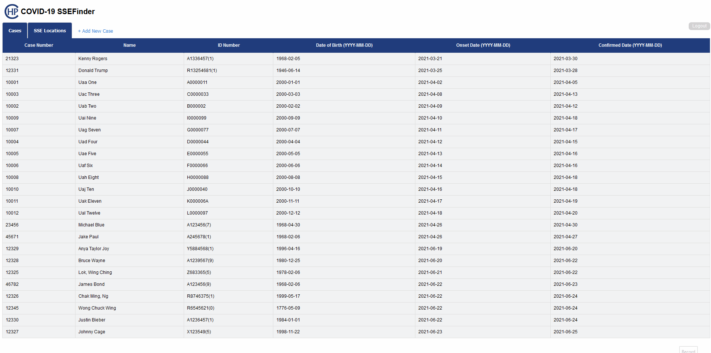
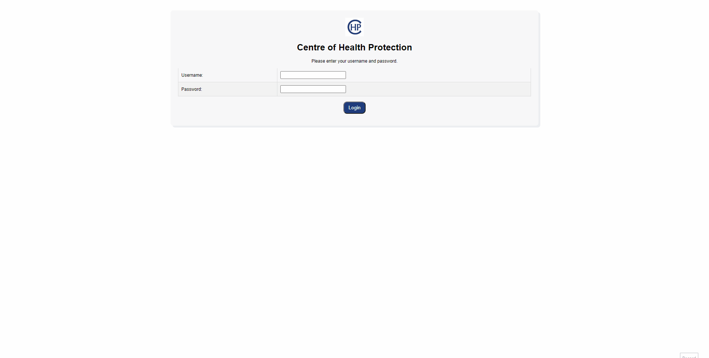
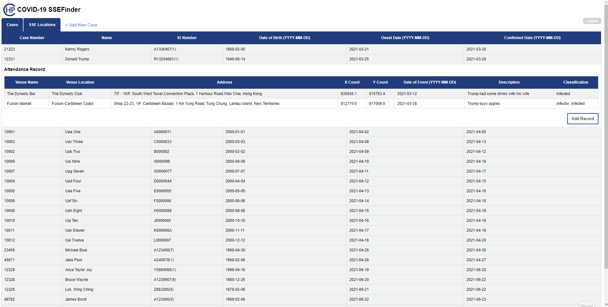
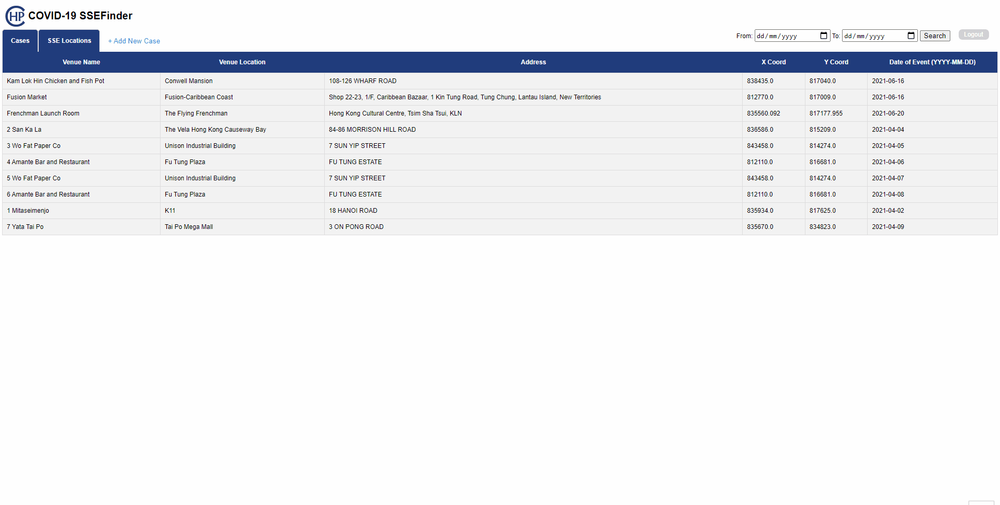

# SSEFinder

## Background

Many studies of the current COVID-19 pandemic point to the significant role played by super spreading events (SSEs) in the explosive growth and sustained transmission of the disease.
SSE Finder helps you record infection cases as well as places visited by these cases before their infection have been confirmed. Allowing the clear identification of SSEs, infector and infected persons of those events.

## [Live Demo](https://ssefinder-comp3297-sprint2.herokuapp.com/)

[https://ssefinder-comp3297-sprint2.herokuapp.com/](https://ssefinder-comp3297-sprint2.herokuapp.com/)

Login using the guest account:

- Username: guest

- Password: ssefinder

## Technologies
Project is created with:
* Python
* Django
* HTML, CSS, JavaScript

## Features
Login & Logout

Add new cases and attendance record, fetch address and coordinate from geodata.gov.hk API

Filter events by date

## Limitations
 
• In the authentication page, user won't know whether it's the username or the password that's wrongly entered --  just that the "username and password didn't match"

• Although the newly entered case number is checked in the backend if it is unique, upon entering the new number, the user may have to do a trial and error since it's not auto-generated

